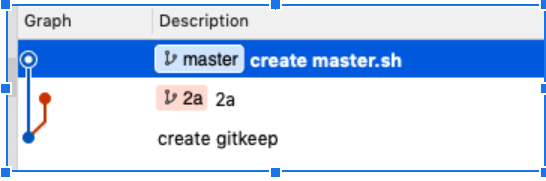
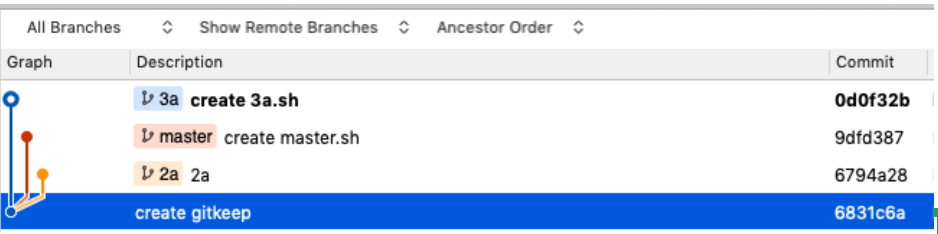

### Git branch應用在多個不同版本的地方
#### 例如:一個資料夾等於多個資料夾用git checkout來做切換:

**git error** :  
**fatal: Not a valid object name: \'master\'**  
如果 __git init__ 後沒有**commit**使用**git branch**會有此**error**

剛創建的git倉庫默認的master分支要在第一次commit之後才會真正建立，否則就像你聲明了個對象但沒初始化一樣。

Step:

```bash
git init  
touch *.sh  
git add *  
git commit   
git branch #show * master
```

{width="3.75in" height="1.1666666666666667in"}

然後要把git head放到create gitkeep 那裡。

> git checkout create gitkeep

一行搞定：到指定的commit並在那裡開啟分支。

如果不想先飛過去再開分支，也是可以直接一行搞定：

> $ git branch branch_name commit_ID

更厲害的創立分支：Checkout 指令配合 -b
參數也可以有開分支的效果，而且還會直接切換過去：

> $ git checkout -b bird 657fce7

{width="6.5in" height="1.5833333333333333in"}

以這個例子：

步驟是先
```bash
mkdir  
git init  
touch .gitkeep  
git add *  
git commit -m 'create gitkeep' #(以後就記得這個commit_id 並用以下的地方)

git branch branch_name commit_ID #來創建只有gitkeep的資料夾，等同於只有空白的資料夾。並先

git checkout branch_name

git add your_folder_file

git commit
```
以上這樣動作之後git checkout回來這個分支時，就是有你這次commit過後的資料了。

### 熱修復
使用branch 開出新的分支，並-b or checkout切換進去，在裡面add & commit 在使用checkout master & git merge最新的分支。

開始使用分支 {#section}
============

在 Git 使用分支很簡單，只要使用 `git branch`{.highlighter-rouge}
指令就行了：

::: {.highlighter-rouge}
``` {.highlight}
$ git branch
* master
```
:::

如果 `git branch`{.highlighter-rouge}
後面沒接任何參數，它僅會印出目前在這個專案有哪些分支。Git
預設會幫你設定一個名為 `master`{.highlighter-rouge} 的分支，前面的星號
`*`{.highlighter-rouge} 表示現在正在這個分支上。

在 SourceTree 看的話，會在左邊的選單上看到「BRANCHES」：

{width="600px"}

目前看到也只有 master 一條分支，在 master
字樣前面的空心小圓圈表示目前正在這個分支上（也就是 HEAD）。

新增分支 {#section-1}
--------

要增加一個分支，就是在執行 `git branch`{.highlighter-rouge}
指令的時候，在後面加上想要的分支的名字：

::: {.highlighter-rouge}
``` {.highlight}
$ git branch cat
```
:::

這樣就新增了一個 `cat`{.highlighter-rouge} 分支，再檢視一下：

::: {.highlighter-rouge}
``` {.highlight}
$ git branch
  cat
* master
```
:::

的確是有多一個分支，但現分支還是在 master 上。

使用 SourceTree
開分支，只要在上面主選單按下「Branch」按鈕便會跳出對話框：

{width="500px"}

在這裡填寫想要開的分支的名字，最下方的「Checkout new
branch」選項如果打勾的話，就會在建立分支完成之後直接切換到該分支。

分支改名字 {#section-2}
----------

如果覺得分支名字取的不夠響亮，想換隨時可以換，而且完全不會影響檔案或目錄。假設現在的分支有這三個：

::: {.highlighter-rouge}
``` {.highlight}
$ git branch
cat
dog
* master
```
:::

然後我想把 `cat`{.highlighter-rouge} 分支改成
`tiger`{.highlighter-rouge} 分支，使用的是 `-m`{.highlighter-rouge}
參數：

::: {.highlighter-rouge}
``` {.highlight}
$ git branch -m cat tiger
```
:::

看一下目前的分支：

::: {.highlighter-rouge}
``` {.highlight}
$ git branch
  tiger
  dog
* master
```
:::

這樣就改掉了。而且即使是 `master`{.highlighter-rouge}
分支想改也可以改，例如想把 `master`{.highlighter-rouge} 改成
`slave`{.highlighter-rouge}：

::: {.highlighter-rouge}
``` {.highlight}
$ git branch -m master slave
```
:::

看一下目前的分支：

::: {.highlighter-rouge}
``` {.highlight}
$ git branch
  tiger
  dog
* slave
```
:::

如果使用 SourceTree
要改分支名字也很簡單，只要在左邊選單的分支上按滑鼠右鍵，選擇「Rename」：

{width="600px"}

接著輸入想要修改的分支名稱即可。

刪除分支 {#section-3}
--------

檢視一下目前的分支：

::: {.highlighter-rouge}
``` {.highlight}
$ git branch
  cat
  dog
* master
```
:::

目前共有三個分支，其中如果 `dog`{.highlighter-rouge}
分支不想要了，可以使用 `-d`{.highlighter-rouge} 參數來刪除它：

::: {.highlighter-rouge}
``` {.highlight}
$ git branch -d dog
Deleted branch dog (was e12d8ef).

$ git branch
  cat
* master
```
:::

`dog`{.highlighter-rouge}
分支就不見了。但如果要刪的分支還沒被完全合併，Git 會有貼心小提示：

::: {.highlighter-rouge}
``` {.highlight}
$ git branch -d cat
error: The branch 'cat' is not fully merged.
If you are sure you want to delete it, run 'git branch -D cat'.
```
:::

的確，因為 `cat`{.highlighter-rouge} 的內容還沒被合併，所以使用
`-d`{.highlighter-rouge} 參數不給刪。這時只要改用
`-D`{.highlighter-rouge} 參數就可以強制刪除：

::: {.highlighter-rouge}
``` {.highlight}
$ git branch -D cat
Deleted branch cat (was b174a5a).
```
:::

使用 `-D`{.highlighter-rouge}
參數可以強制把還沒合併的分支砍掉，但如果後悔想救回來，請見「[【狀況題】不小心把還沒合併的分支砍掉了，救得回來嗎？](/chapters/branch/restore-deleted-but-unmerged-branch.html)」章節的說明。

使用 SourceTree
的話，則是在左邊分支的選單上按滑鼠右鍵，選擇「Delete...」功能：

{width="600px"}

它會出現一個對話框，按下 OK 按鈕就可以把指定的分支刪除：

{width="400px"}

同樣的，如果該分支還沒被完全合併但仍想強制刪除，則勾選「Force
delete」就可順利刪除。

### 沒有什麼分支是不能刪的！ {#section-4}

在 Git 裡什麼分支都可以刪，包括預設的 `master`{.highlighter-rouge}
也可以，`master`{.highlighter-rouge}
分支只是預設的分支，它並沒有比較特別。真的硬要說哪個分支不能刪的，只有「現在目前所在的分支」不能刪而已（因為刪了的話要去哪裡？），不過只要先切到別的分支就可以刪掉它了。

切換分支 {#section-5}
--------

要切換分支，使用的指令在前面「[【狀況題】啊！不小心把檔案或目錄刪掉了...](/chapters/using-git/recover-deleted-files.html)」章節也曾經出現過，就是
`git checkout`{.highlighter-rouge}：

::: {.highlighter-rouge}
``` {.highlight}
$ git checkout cat
Switched to branch 'cat'
```
:::

看一下目前的分支狀態：

::: {.highlighter-rouge}
``` {.highlight}
$ git branch
* cat
  dog
  master
```
:::

前面的那個星號已經移到 `cat`{.highlighter-rouge} 分支上了。

如果是使用
SourceTree，則是在左邊選單的分支名字上按滑鼠右鍵，選擇「Checkout ...」

{width="650px"}

或是直接在分支名字上點兩下也可以切換過去，切換成功的話前面的空心小圈圈（也就是那個
HEAD 啦）就會移到切換的分支上了。

{width="350px"}

接下來操作就跟一般的差不多，一樣都是先 `add`{.highlighter-rouge} 再
`commit`{.highlighter-rouge}，但不一樣的是，當你在 Commit
的時候就只有那個分支會前進喔。

切換分支的時候... {#section-6}
-----------------

舉個例子來說，我切換到 `cat`{.highlighter-rouge} 線，然後在這邊加了兩次
Commit，分別新增一個 `cat1.html`{.highlighter-rouge} 跟
`cat2.html`{.highlighter-rouge}：

::: {.highlighter-rouge}
``` {.highlight}
$ git checkout cat
Switched to branch 'cat'

$ touch cat1.html

$ git add cat1.html

$ git commit -m "add cat 1"
[cat c68537b] add cat 1
 1 file changed, 0 insertions(+), 0 deletions(-)
 create mode 100644 cat1.html

$ touch cat2.html

$ git add cat2.html

$ git commit -m "add cat 2"
[cat b174a5a] add cat 2
1 file changed, 0 insertions(+), 0 deletions(-)
create mode 100644 cat2.html
```
:::

看一下 Git 紀錄：

::: {.highlighter-rouge}
``` {.highlight}
$ git log --oneline
b174a5a (HEAD -> cat) add cat 2
c68537b add cat 1
e12d8ef (master, dog) add database.yml in config folder
85e7e30 add hello
657fce7 add container
abb4f43 update index page
cef6e40 create index page
cc797cd init commit
```
:::

的確比 `master`{.highlighter-rouge} 以及 `dog`{.highlighter-rouge}
分支多前進了兩次的 Commit。再看一下檔案列表：

::: {.highlighter-rouge}
``` {.highlight}
$ ls -al
total 16
drwxr-xr-x   9 eddie  wheel   306 Aug 17 18:38 .
drwxrwxrwt  72 root   wheel  2448 Aug 17 18:18 ..
drwxr-xr-x  16 eddie  wheel   544 Aug 17 18:38 .git
-rw-r--r--   1 eddie  wheel     0 Aug 17 18:38 cat1.html
-rw-r--r--   1 eddie  wheel     0 Aug 17 18:38 cat2.html
drwxr-xr-x   3 eddie  wheel   102 Aug 17 15:06 config
-rw-r--r--   1 eddie  wheel     0 Aug 17 15:06 hello.html
-rw-r--r--   1 eddie  wheel   161 Aug 17 18:00 index.html
-rw-r--r--   1 eddie  wheel    11 Aug 17 14:56 welcome.html
```
:::

在這兩次的 Commit 中，共新增了 `cat1.html`{.highlighter-rouge} 及
`cat2.html`{.highlighter-rouge} 這兩個檔案。這時候，如果切換回原本的
`master`{.highlighter-rouge} 分支：

::: {.highlighter-rouge}
``` {.highlight}
$ git checkout master
Switched to branch 'master'
```
:::

再看一下檔案列表：

::: {.highlighter-rouge}
``` {.highlight}
$ ls -al
total 16
drwxr-xr-x   7 eddie  wheel   238 Aug 17 19:10 .
drwxrwxrwt  72 root   wheel  2448 Aug 17 18:18 ..
drwxr-xr-x  16 eddie  wheel   544 Aug 17 19:10 .git
drwxr-xr-x   3 eddie  wheel   102 Aug 17 15:06 config
-rw-r--r--   1 eddie  wheel     0 Aug 17 15:06 hello.html
-rw-r--r--   1 eddie  wheel   161 Aug 17 18:00 index.html
-rw-r--r--   1 eddie  wheel    11 Aug 17 14:56 welcome.html
```
:::

咦？剛剛那兩個檔案不見了！別擔心，其實他們都還在的，只是在不同的分支而已，只要切回
`cat`{.highlighter-rouge} 分支，檔案就會出現了。

要切換到那個分支，首先你要有那個分支... {#section-7}
---------------------------------------

如果要切換到某個分支，那個分支必要先存在，不然會發生錯誤：

::: {.highlighter-rouge}
``` {.highlight}
$ git checkout sister
error: pathspec 'sister' did not match any file(s) known to git.
```
:::

醒醒吧，你沒有這個分支...但沒關係，在
`git checkout 分支名稱`{.highlighter-rouge} 的時候加上
`-b`{.highlighter-rouge}
參數就沒問題了。如果這個分支本來就存在，那就會直接切換過去；如果不存在，Git
就會幫你建一個，然後再切換過去：

::: {.highlighter-rouge}
``` {.highlight}
$ git checkout -b sister
Switched to a new branch 'sister'
```
:::

這樣就搞定了！

------------------------------------------------------------------------

